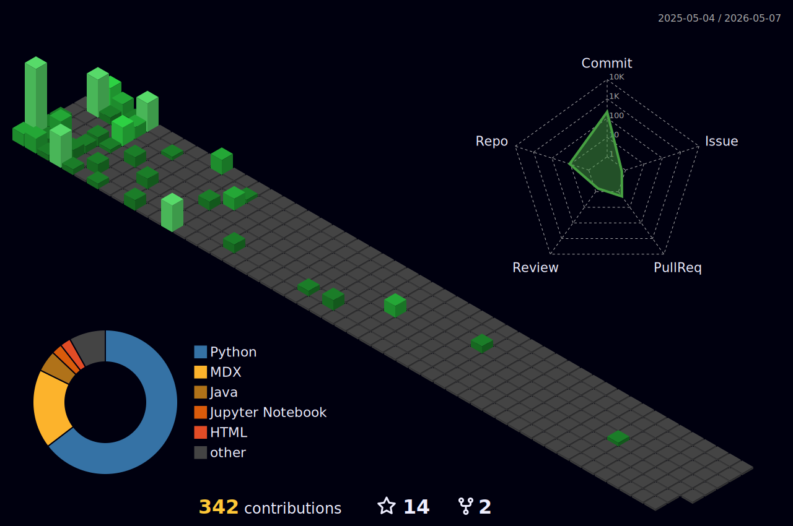

<h1 align="Left">Hi there </h1>

### 🌟 About Me
- 🔭 **Currently working on:** Something cool :wink:
- 🌱 **Learning:** MLOps, Kafka (where data and _Metamorphosis_ coalesce 🪶)
- 👯 **Looking to collaborate on:** ML-driven healthcare solutions.
- 🤝 **Need help with:** Curating a high-quality chemical compounds dataset.
- 💬 **Ask me about:** ML, Quantum Computing and why NP-completeness makes me reconsider my life choices. 🤔
- 📫 **Reach me at:** w.nishantsheoran@gmail.com.
- 🌐 **Portfolio:** [View Here](https://nishant.is-a.dev/)
- ⚡ **Fun fact:** “To code, or not to code?” ~ Hamlet 😂
<!-- 📄 **Resume:** [View Here](https://drive.google.com/file/d/12sgJ7snn4HcypoNj1hWYTdOdKWWFIRsv/view?usp=sharing). -->
### 📕 Latest Blog Posts
<!-- BLOG-POST-LIST:START -->
- [Building a Git-Powered, Multi-Repo Content Pipeline with ISR &amp; Zero Vendor Lock-in](https://nishant-sheoran.medium.com/building-a-git-powered-multi-repo-content-pipeline-with-isr-zero-vendor-lock-in-983b91a21e57?source=rss-45443248d491------2)
- [Transforming Retail with Machine Learning: Predicting Future Sales](https://nishant-sheoran.medium.com/transforming-retail-with-machine-learning-predicting-future-sales-fec92fe735b0?source=rss-45443248d491------2)
<!-- BLOG-POST-LIST:END -->

  <picture>
    <source media="(prefers-color-scheme: dark)" srcset="svg-files/github-snake-dark.svg" />
    <source media="(prefers-color-scheme: light)" srcset="svg-files/github-snake.svg" />
    
  </picture>

  
<b>🛠️&nbsp;&nbsp;Languages&nbsp;and&nbsp;Tools</b>

   
  
 
  
  
  
  
  
  
  
  
  
  
  
  
  
  
  
  
  
  
  
  
  
  
  
   

---
### 🌌 GitHub Respawn

  <picture>
    
  </picture>

---

### 🌐 Connect with Me

  
  
  
  
  

